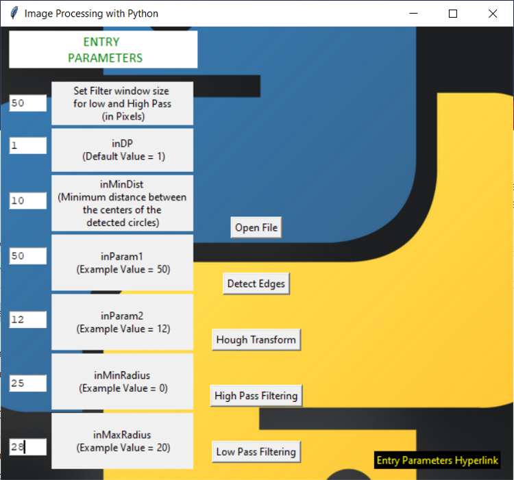
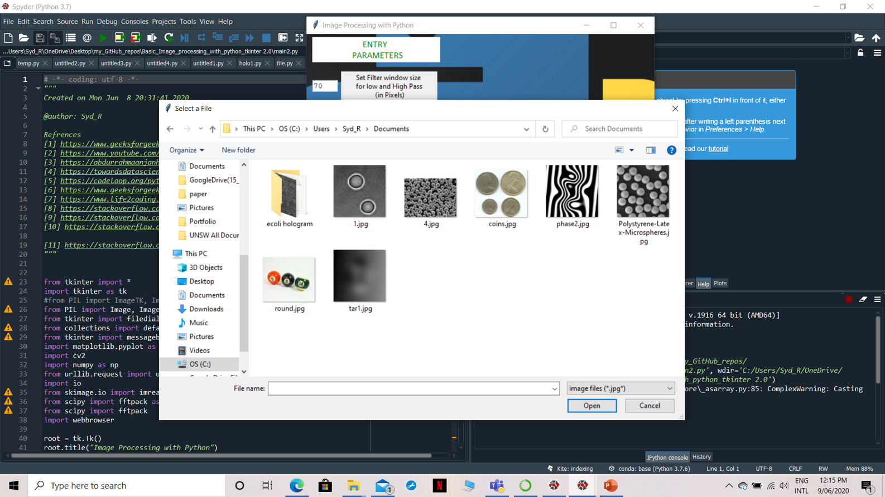
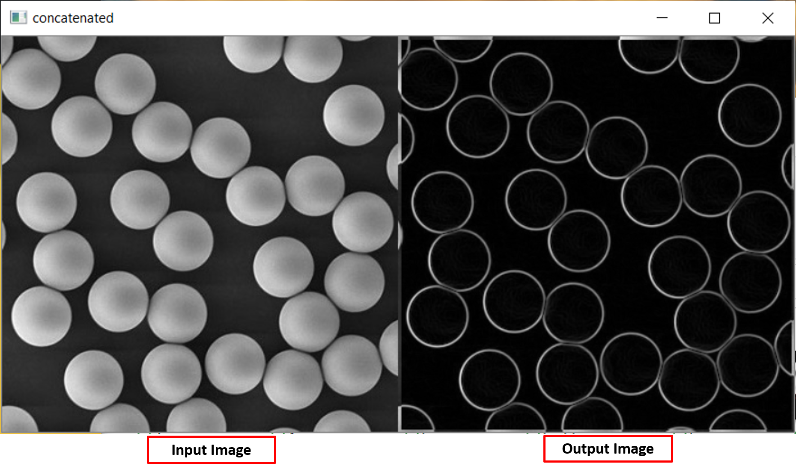
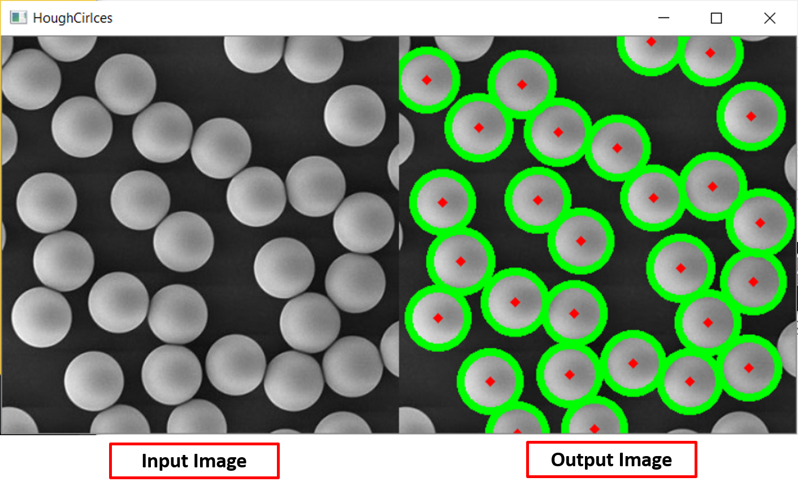
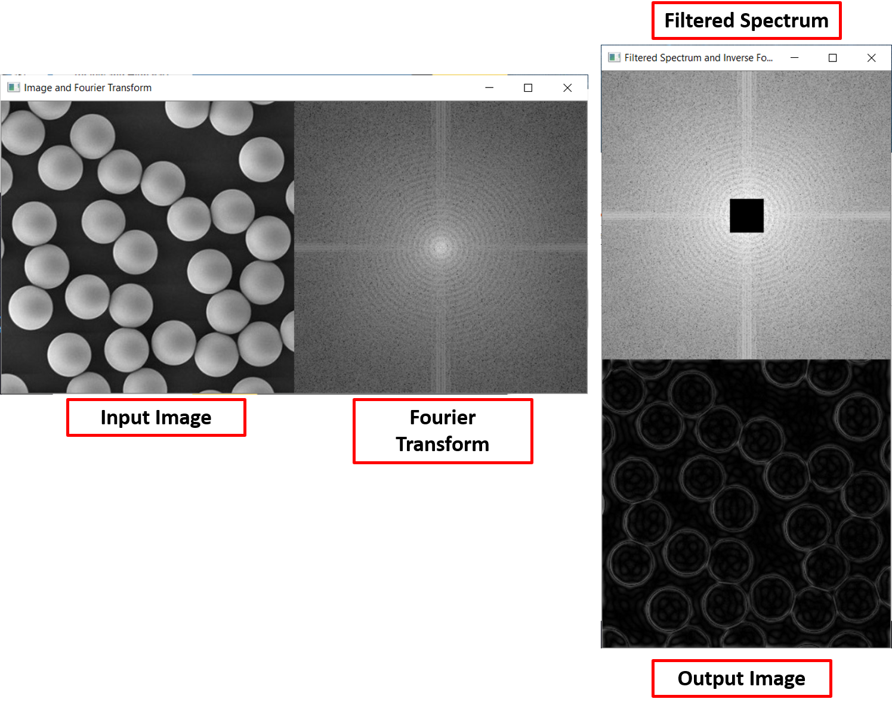
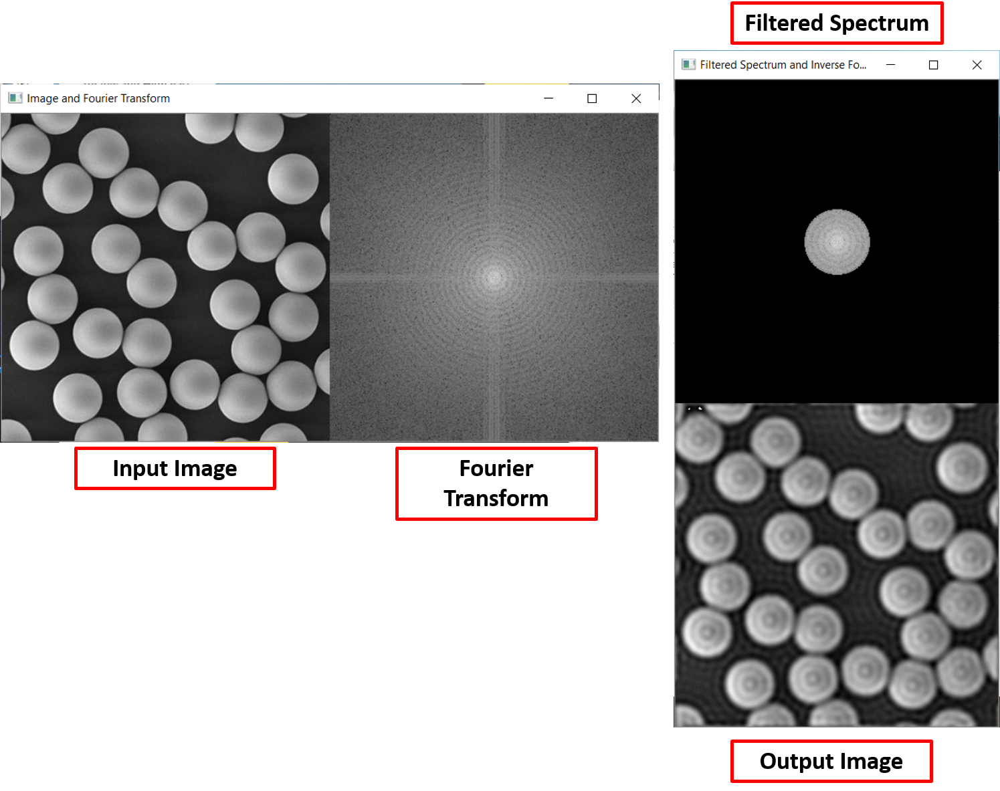

# Basic_Image_Processing_with_Python_Tkinter 
### Perform Edge Detection, Hough Transforms, Low and High Pass Filtering on Images with Tkinter Package
### Update: Added Entry Parameters Text Boxes 
### GUI 

### Select files from the explorer

###  Detect edges using a 3x3 horizontal and vertical kernel

###  Detect and label round objects in an image 
#### The object size might vary for  images so you should tweak in the appropriate values in the **Entry Parameters Text Boxes**.

###  High pass Fourier filtering 
#### Filters out low and filter in high spatial frequencies.

###  Low pass Fourier filtering 
#### Filters out high and filter in low spatial frequencies.

